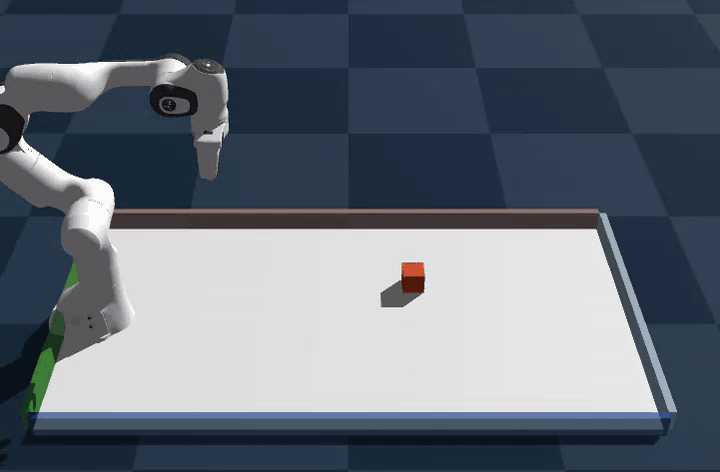
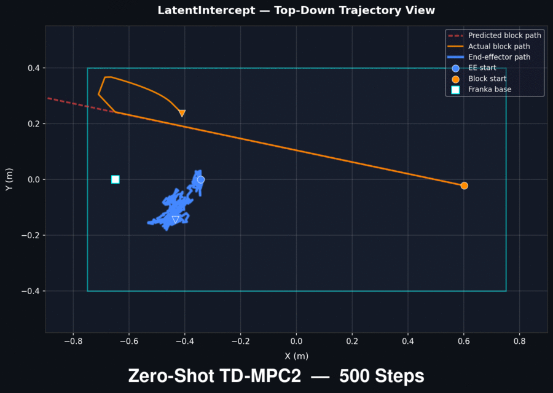
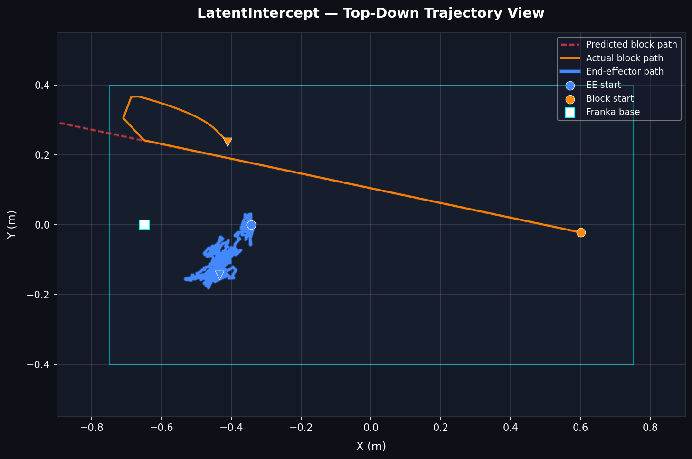
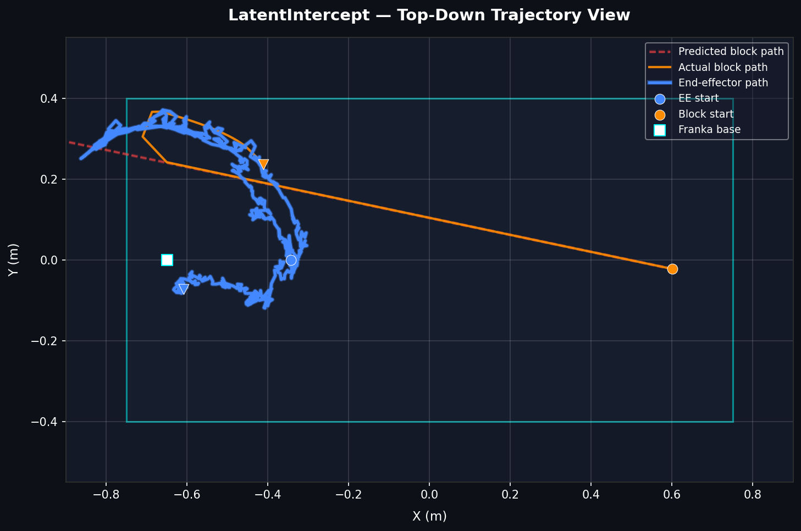
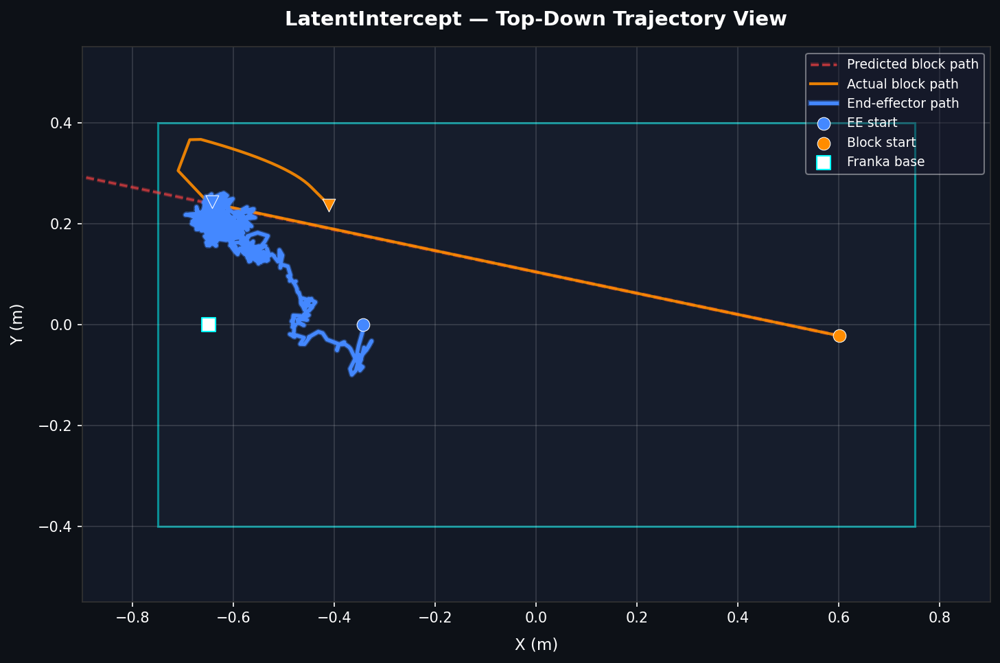
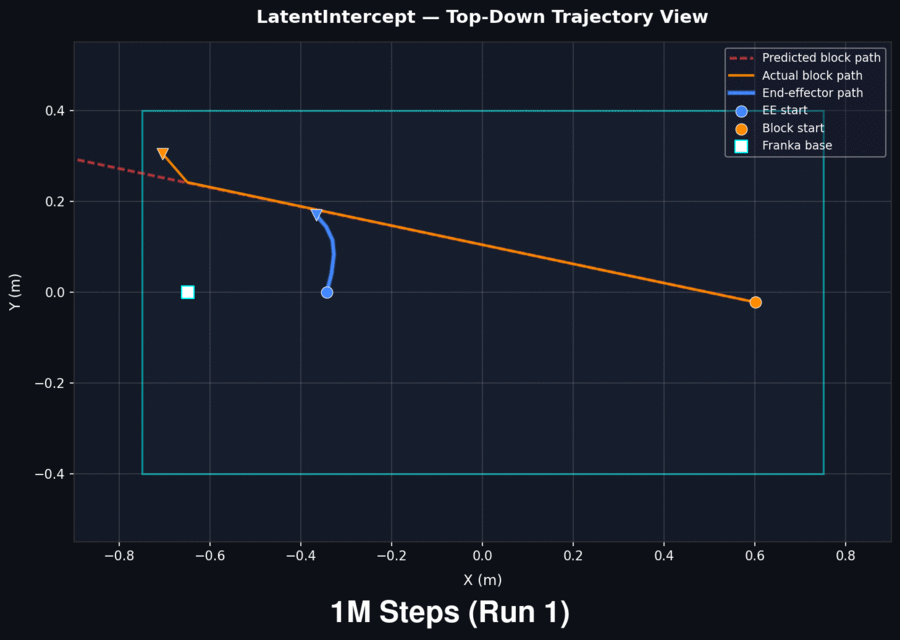
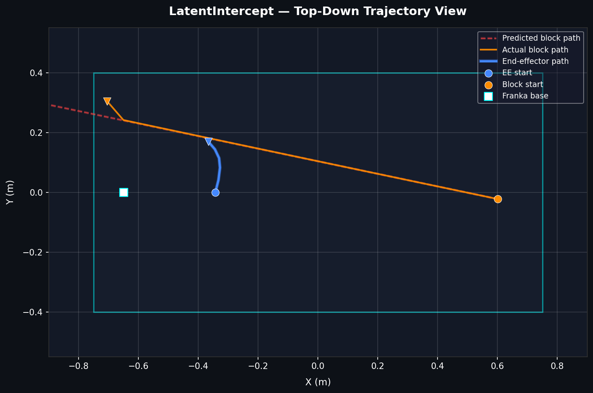
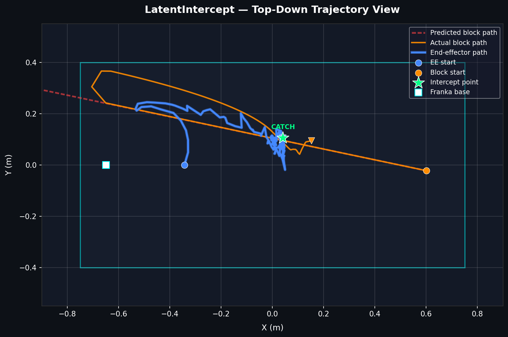
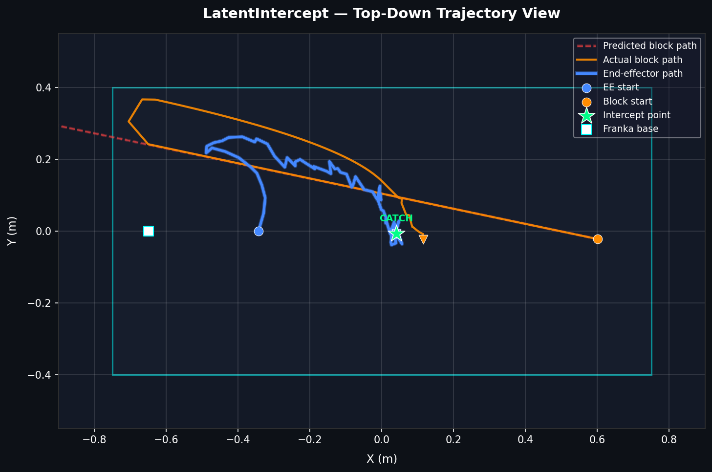
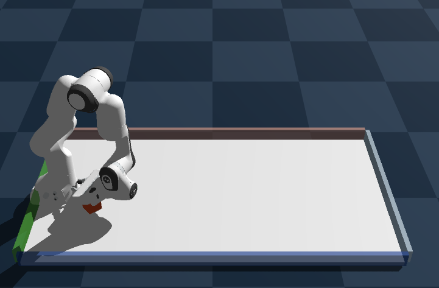

# LatentIntercept

**TD-MPC2 + Genesis** robotics RL — a Franka Emika arm learns to intercept a sliding block in real time.




## Overview

A 7-DOF Franka arm sits at a table. A block is launched from the far end at random speed (1.5–3.5 m/s) and angle (±30°). The agent must intercept the block before it exits the workspace — an *air-hockey goalie* problem requiring predictive planning.

**Why TD-MPC2?** Its learned world model enables MPPI planning 12 steps ahead (~1.2 s), letting the arm *anticipate* the block trajectory rather than react to it.

## Quick Start

```bash
# 1. Install
pip install -r requirements.txt
pip install git+https://github.com/nicklashansen/tdmpc2.git

# 2. Validate physics scene
python scripts/validate_env.py --steps 150

# 3. Train (dry-run)
python scripts/train.py training.total_steps=1000

# 4. Full training
python scripts/train.py
tensorboard --logdir runs/

# 5. Monitor training health
python scripts/monitor.py

# 6. Evaluate
python scripts/infer.py --checkpoint trained_models/final.pt --render

# 7. Portfolio plot
python scripts/visualize_trajectories.py \
    --checkpoint trained_models/final.pt \
    --output outputs/trajectory_3d.png --pdf
```

## Architecture

```
configs/base_config.yaml          ← All hyperparameters
scripts/
  validate_env.py                 ← Visual smoke-test
  train.py                        ← TD-MPC2 training loop
  infer.py                        ← Checkpoint evaluation
  monitor.py                      ← TensorBoard health check
  visualize_trajectories.py       ← 3D trajectory plot (PNG/PDF)
src/
  environments/
    air_hockey_env.py             ← Genesis scene (Franka + table + block)
    wrapper.py                    ← 24D obs, dense reward, TD-MPC2 interface
  agent/
    tdmpc2_config.py              ← OmegaConf config builder
  utils/
    logger.py                     ← TensorBoard scalar logging
```

## Observation Space (24D)

| Index | Description |
|-------|-------------|
| 0–6   | Franka joint angles (rad) |
| 7–13  | Franka joint velocities (rad/s) |
| 14    | Gripper finger position (m) |
| 15–17 | Block position XYZ (m) |
| 18–20 | Block velocity XYZ (m/s) |
| 21–23 | EE → Block relative vector (m) |

## Reward

```
R = 0.4·exp(-‖p_ee - p_block‖) + 0.2·exp(-‖v_ee - v_block‖) + 10·catch_bonus
```

Dense distance + velocity-matching signal ensures continuous gradient. The catch bonus (dist < 5 cm & vel_diff < 0.5 m/s) provides the terminal objective.

## Zero-Shot Results (TD-MPC2, Untrained)

Before any training, the TD-MPC2 agent runs with a **randomly initialised** world model and policy. MPPI planning (512 samples, 12-step horizon) effectively degenerates to random search since the latent dynamics carry no predictive information yet.

### Trajectory Plots — 500 / 700 / 1000 Steps



| 500 Steps | 700 Steps | 1000 Steps |
|-----------|-----------|------------|
|  |  |  |

- **500 steps** — EE jitters in a tight cluster near home pose; no goal-directed motion.
- **700 steps** — Longer episode lets random joint deltas accumulate into a sweeping arc; EE reaches the block's quadrant by coincidence, not learned tracking.
- **1000 steps** — EE drifts further toward the block's post-bounce region due to joint-limit saturation bias. Still **no successful intercept** (CATCH).

### Genesis Simulation — Side-by-Side


> Full per-run analysis: [`videos/inferences_zero_shot_500_700_1000.md`](videos/inferences_zero_shot_500_700_1000.md)

## Trained Results — 1M Steps

After **1 000 000 training steps** the world model and policy have learned the task dynamics. MPPI planning now operates over a **meaningful latent space**, enabling the arm to predict the block's trajectory and move to intercept it.

### Trajectory Plots — 1M Trained (3 evaluation episodes)



| Run 1 (near-miss) | Run 2 (CATCH) | Run 3 (CATCH) |
|--------------------|---------------|---------------|
|  |  |  |

- **Run 1** — The EE executes a **smooth, purposeful arc** toward the block's predicted path. The motion is clean and low-jitter compared to zero-shot, showing the world model has learned meaningful dynamics. Near-miss — the arm arrives at the block's region but doesn't satisfy the catch threshold.
- **Run 2** — **Successful CATCH.** The EE sweeps across the workspace, tracks the block through its bounce, and intercepts it at ~(0.0, 0.1). The green star confirms the distance and velocity thresholds were met simultaneously.
- **Run 3** — **Successful CATCH.** The EE follows a wider pursuit arc, converging on the block near the table centre at ~(0.0, 0.0). The trajectory is noticeably smoother than any zero-shot attempt — the learned value function provides a clear gradient for MPPI to exploit.

### Genesis Simulation — Trained Agent


**Successful pickup** (1M-step policy, Genesis viewer):



### Zero-Shot vs Trained — Key Differences

| | Zero-Shot (0 steps) | Trained (1M steps) |
|---|---|---|
| EE motion | Random jitter / kinematic drift | Smooth, goal-directed arcs |
| MPPI planning | Degenerates to random search | Exploits learned latent dynamics |
| Block tracking | None — coincidental proximity | Active pursuit through bounce |
| Intercept success | 0 / 3 | 2 / 3 (CATCH) |

## Key Hyperparameters

| Parameter | Value | Notes |
|-----------|-------|-------|
| Parallel envs | 256 | GPU-batched Genesis scenes |
| MPPI horizon | 12 | ~1.2 s lookahead at 10 Hz |
| Learning rate | 3e-4 | Adam, world model + policy |
| Replay buffer | 1M | Uniform sampling |
| Total steps | 10M | Checkpoint every 1M |

## License

MIT
